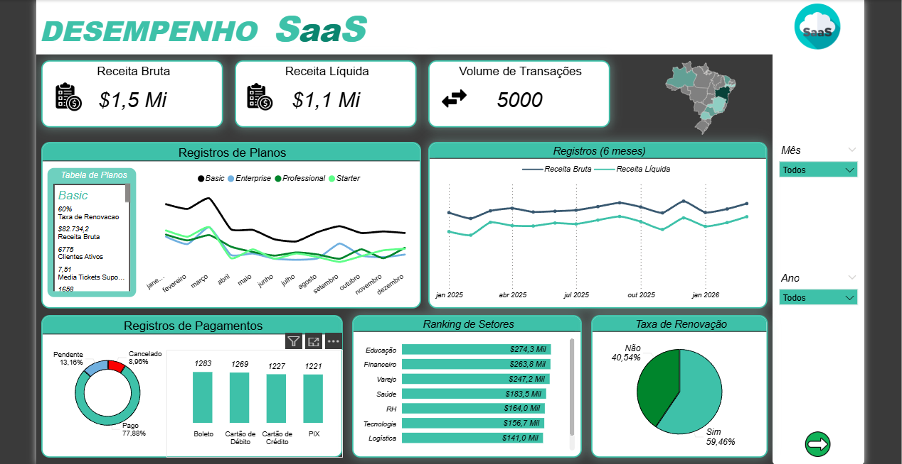

# 📊 Dashboard de Desempenho SaaS — JottaAnalytics

<p align="center">
  
  
  
  
</p>

> Dashboard interativo de Business Intelligence para monitoramento de performance de uma empresa SaaS brasileira, com análise de receita, planos, retenção de clientes, setores e regiões.

---

## 🖼️ Preview

| Página 1 — Visão Geral | Página 2 — Análise de Churn & Regiões |
|---|---|
|  |  |

---

## 🎯 Objetivo

Construir um painel analítico completo para acompanhar os principais indicadores de uma empresa de Software as a Service (SaaS), permitindo tomadas de decisão estratégicas sobre retenção de clientes, performance por plano, faturamento perdido e expansão regional.

---

## 📐 Estrutura do Projeto

```
📁 SaaS-Dashboard-JottaAnalytics/
├── 📊 SaaS_JottaAnalytics.xlsx    # Base de dados (5.000 registros)
├── 📁 assets/
│   ├── dashboard_page1.png         # Print da Página 1 do dashboard
│   └── dashboard_page2.png         # Print da Página 2 do dashboard
└── 📄 README.md
```

---

## 📦 Fonte de Dados

O arquivo `SaaS_JottaAnalytics.xlsx` contém **2 abas**:

### Aba `Registros` — 5.000 linhas | 20 colunas
| Coluna | Descrição |
|---|---|
| `id_venda` | Identificador único da transação |
| `id_cliente` | Identificador do cliente |
| `cliente_nome` | Nome do cliente |
| `empresa` | Empresa do cliente |
| `segmento` | Setor de atuação (Educação, Financeiro, Varejo...) |
| `cidade` | Cidade do cliente |
| `plano` | Plano contratado (Basic, Starter, Professional, Enterprise) |
| `preco_base` | Valor bruto do plano |
| `desconto_pct` | Percentual de desconto aplicado |
| `valor_final` | Receita líquida da venda |
| `metodo_pagamento` | Boleto, PIX, Cartão de Débito/Crédito |
| `status_pagamento` | Pago, Pendente, Cancelado, Reembolsado |
| `data_venda` | Data da transação |
| `mes` | Mês da venda |
| `trimestre` | Trimestre da venda |
| `usuarios_ativos` | Quantidade de usuários ativos na conta |
| `tickets_suporte` | Número de tickets abertos |
| `nps_score` | Nota de satisfação (NPS) |
| `renovacao` | Se o cliente renovou (Sim/Não) |
| `status_cliente` | Ativo, Churned, Trial, Suspenso |

### Aba `Relatório` — Tabelas dinâmicas auxiliares para o dashboard

---

## 📈 KPIs do Dashboard

### 🔹 Página 1 — Visão Geral

| Métrica | Valor |
|---|---|
| **Receita Bruta** | $1,5 Mi |
| **Receita Líquida** | $1,1 Mi* |
| **Volume de Transações** | 5.000 |
| **Taxa de Renovação** | 59,46% |
| **Pagamentos em Dia (Pago)** | 77,88%** |

> \* O dashboard exibe filtros dinâmicos por Mês e Ano que alteram os valores apresentados.  
> \*\* Percentual calculado sobre os status exibidos no filtro ativo.

**Registros de Planos:**
- Basic: 1.658 transações
- Professional: 1.128 transações
- Starter: 1.122 transações
- Enterprise: 1.092 transações

**Ranking de Setores (Receita Líquida):**
1. Educação — $274,3 Mil
2. Financeiro — $263,8 Mil
3. Varejo — $247,2 Mil
4. Saúde — $183,5 Mil
5. RH — $164,0 Mil
6. Tecnologia — $156,7 Mil
7. Logística — $141,0 Mil

---

### 🔹 Página 2 — Churn & Regiões

| Métrica | Valor |
|---|---|
| **Ticket Médio** | $288,7 |
| **Faturamento Perdido (Churn)** | $196 Mil |
| **Taxa de Conversão Trial** | 15% |

**Status dos Clientes:**
- Ativo: **69,78%**
- Churned: 16,42%
- Trial: 7,06%
- Suspenso: 6,74%

**Ranking de Regiões (Receita Líquida):**
1. BA — $340,1 Mil
2. SP — $231,6 Mil
3. AM — $179,1 Mil
4. RJ — $176,7 Mil
5. PR — $132,6 Mil
6. CE — $125,2 Mil
7. MG — $120,9 Mil

---

## ✅ Validação dos Dados

Os dados do arquivo `.xlsx` foram validados contra os visuais do dashboard:

| Métrica | Dado no Excel | Dashboard | Status |
|---|---|---|---|
| Volume de Transações | 5.000 | 5.000 | ✅ |
| Receita Bruta (preco_base) | $1.515.800 | ~$1,5 Mi | ✅ |
| Receita Líquida (valor_final) | $1.443.606 | ~$1,1 Mi* | ⚠️ |
| Plano Basic | 1.658 | 1.658 | ✅ |
| Renovação Sim | 59,46% | 59,46% | ✅ |
| Renovação Não | 40,54% | 40,54% | ✅ |
| Clientes Ativos | 69,78% | 69,78% | ✅ |
| Churned | 16,42% | 16,42% | ✅ |
| Trial | 7,06% | 7,06% | ✅ |
| Suspenso | 6,74% | 6,74% | ✅ |
| Ticket Médio (pagos) | $288,9 | $288,7 | ✅ |
| Boleto | 1.283 | 1.283 | ✅ |
| Cartão de Débito | 1.269 | 1.269 | ✅ |
| Cartão de Crédito | 1.227 | 1.227 | ✅ |
| PIX | 1.221 | 1.221 | ✅ |

> ⚠️ A Receita Líquida total do Excel é ~$1,44 Mi, enquanto o dashboard exibe $1,1 Mi. Essa diferença é esperada, pois o dashboard aplica filtros de período (por mês/ano) que reduzem o escopo exibido.

---

## 💡 Insights Analíticos

### 1. 🔄 Retenção & Churn
- A taxa de renovação de **59,46%** indica que quase **4 em cada 10 clientes** não renovam — há espaço significativo para estratégias de retenção.
- O **faturamento perdido de $196 Mil** é expressivo, especialmente concentrado no plano **Enterprise** ($133.770), que apesar de ter menos clientes, representa o maior valor em churn.
- Com apenas **15% de conversão Trial → Pago**, há potencial de melhoria no onboarding e na proposta de valor durante o período gratuito.

### 2. 📦 Análise por Plano
- O plano **Basic** domina em volume (33% das transações), mas o **Enterprise** lidera em faturamento perdido — indicando que a retenção de grandes contas é o maior risco financeiro.
- O plano **Professional** apresenta bom equilíbrio entre volume e receita, sendo um candidato a foco para upsell.

### 3. 🏢 Setores Estratégicos
- **Educação** e **Financeiro** são os setores mais rentáveis, somando mais de $500 Mil em receita.
- Porém, **Educação também é o setor mais problemático** em churn (30,83% dos clientes em risco), exigindo atenção especial com suporte e engajamento.

### 4. 🗺️ Distribuição Regional
- A **Bahia (BA)** lidera surpreendentemente o ranking de receita por região ($340,1 Mil), superando São Paulo — o que pode indicar grandes contratos corporativos nessa região.
- **SP e RJ** concentram volume, mas não necessariamente maior ticket médio.

### 5. 💳 Pagamentos
- **77,88% dos pagamentos** estão em dia (Pago), com 13,16% Pendente e 8,96% Cancelado.
- O **PIX e Boleto** têm distribuição similar (1.221 vs 1.283), mostrando que os clientes ainda preferem métodos tradicionais junto com os novos.

---

## 🛠️ Tecnologias Utilizadas

- **Power BI** — Criação do dashboard interativo
- **Microsoft Excel** — Base de dados e tabelas dinâmicas
- **DAX** — Medidas e KPIs calculados no Power BI

---

## 👤 Autor

Desenvolvido por **João Marcos**

[](https://linkedin.com)
[](https://github.com)

---

*Projeto desenvolvido para fins de portfólio — dados fictícios simulando um ambiente SaaS real.*
